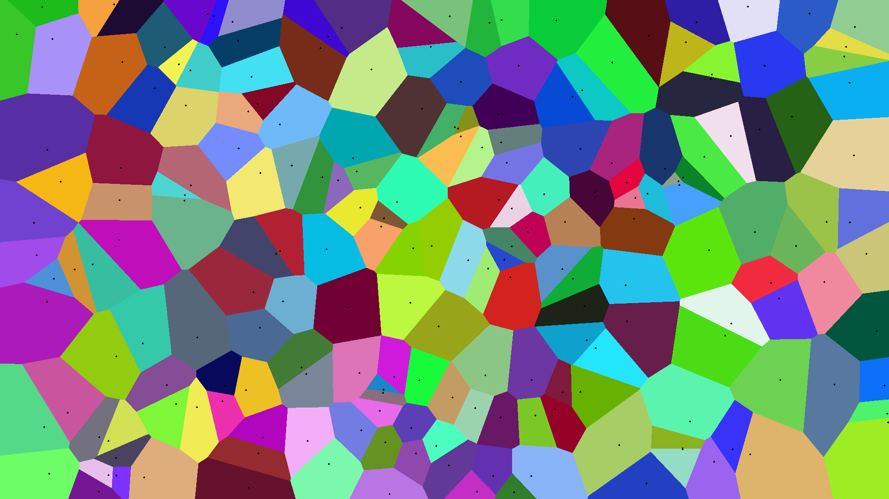
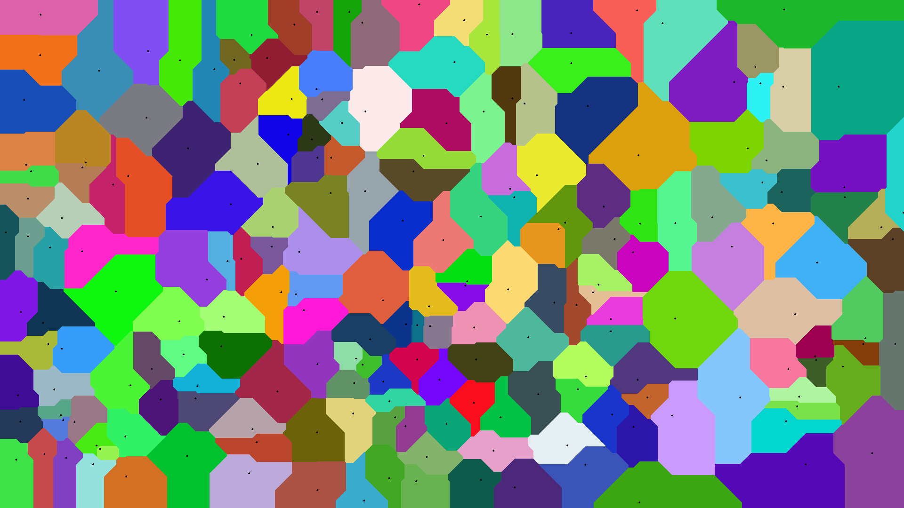

# Voronoi Image Generator

<h4>Voronoi diagram with Euclidean distance formula</h4>

<h4>Voronoi diagram with Manhattan distance formula</h4>


--------------
<h3>Under Construction</h3>
Delaunay triangulation algorithm for more interesting voronoi diagrams.

--------------
<h3>Build</h3>

<h4>Windows</h4>

Run with default inputs: 
Euclidean, 1920x1080 resolution and 500 points 

```
make run
```
or
```
make build
./build <distance formula(0-euclidean, 1-manhattan)> <paint points(0-no, 1-yes)> <image width> <image height> <number of points> <seed for random generator>
```

<h4>Linux</h4>

With default inputs
```
make run
```
or
```
make build
./build <distance formula(0-euclidean, 1-manhattan)> <paint points(0-no, 1-yes)> <image width> <image height> <number of points> <seed for random generator>
```